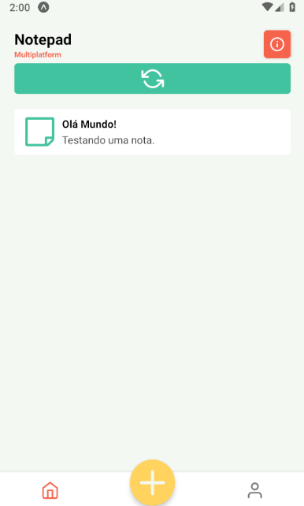
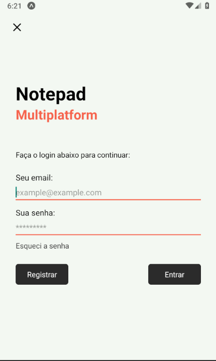
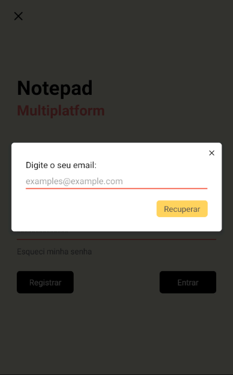
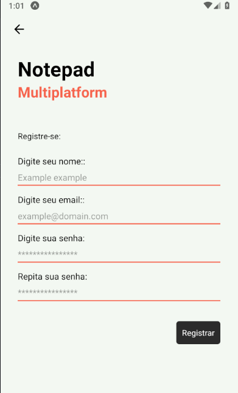
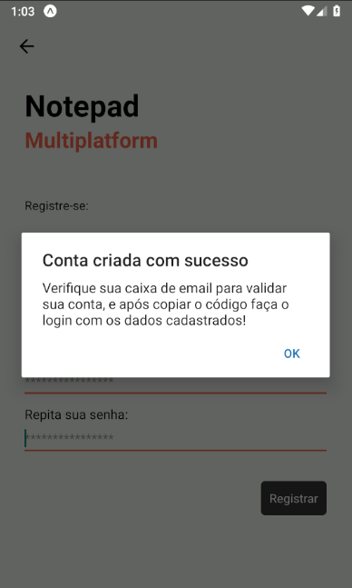
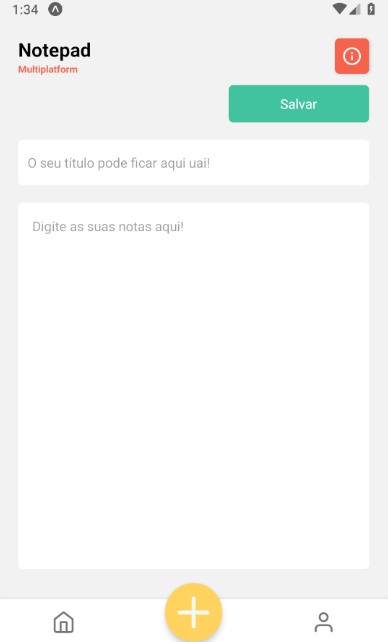
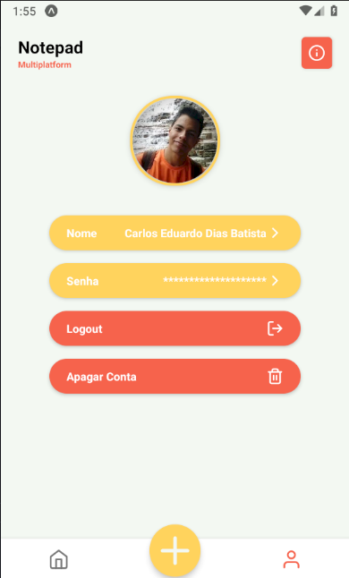
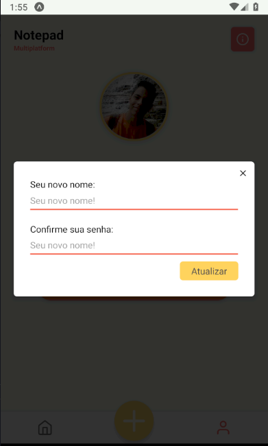

<h1>Notepad Multiplatform</h1>

## **OBJETIVO**

O projeto tem como finalidade a criação de notas em multiplos dispositivos em um banco de dados centralizado usando uma api unica.

## **Fotos do Projeto**

|              Home              |             Login              |
| :----------------------------: | :----------------------------: |
|  |  |

|      Recuperação de conta      |           Registrar            |
| :----------------------------: | :----------------------------: |
|  |  |

| Alertas para orientação do usuário |      Verificação de conta      |
| :--------------------------------: | :----------------------------: |
|      |  |

| Tela de criação e edição de nota | Tela do perfil do usuário para recuperação da conta e trocar do nome |
| :------------------------------: | :------------------------------------------------------------------: |
|    |                                       |

Telas de alterações com conirmação de senha.

## **Como testar**

Antes de começar você precisará ter instalado em sua máquina o seguite:

<ul>
    <a href="https://git-scm.com">Git: https://git-scm.com</a>    
         
    <a href="https://git-scm.com">Expo: https://docs.expo.io/get-started/installation/</a>    
         
</ul>

Você precisará de um editor de texto como o VSCode ou o PHPStorm

Também é necessário um compilador SASS.

### Rodando o Projeto

<ul>
    <li>Para rodar este projeto você precisará seguir os passos de instalação da <a href="https://github.com/carloseduardodb/notepad-multiplatform-api">api</a> em Laravel.</li>
    <li>Após seguir os passos da instalação e iniação do server da api continue abaixo.</li>
    

</ul>

### Passos

<ul> 
  <li>Instale o <a href="https://git-scm.com/downloads">Git</a> em sua máquina
  </li>
  <li>Instale o <a href="https://nodejs.org/en/download/">NodeJS</a> em sua máquina</li> 
  <li>Instale o <a href="https://docs.expo.io/get-started/installation/">Expo</a> em sua máquina</li> 
  <li>Entre na sua pasta de projetos e rode o comando abaixo:</li> 
  <li>git clone https://github.com/carloseduardodb/notepad-multiplatform-mobile.git</li> 
  <li>Após isso rode o comando npm install ou yarn install</li>
</ul>

### Tecnologias

As seguintes ferramentas foram usadas na construção do projeto:

<ul>
    <li>React Native</li>
    <li>Expo</li>
    <li>Typescript</li>
</ul>

### Autor

<a href="">
 
  
 <b>Carlos Eduardo</b></a>

Feito com ❤️ por Carlos Eduardo

<a href="mailto:carloseduardodiasbatista@gmail.com">Entre em contato</a>

